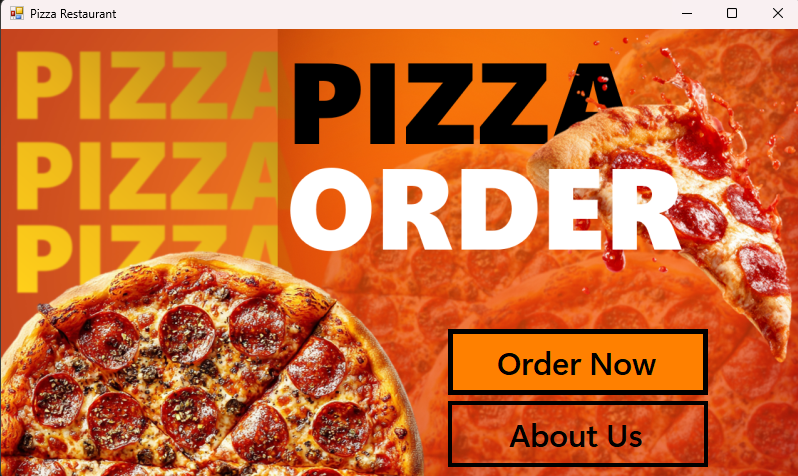
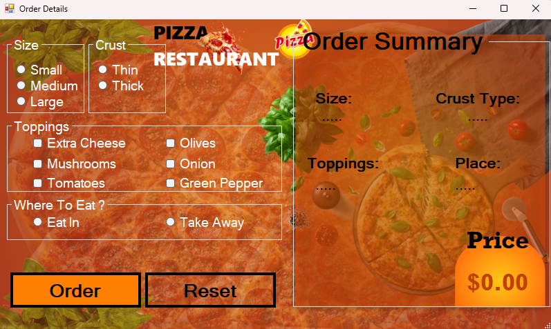
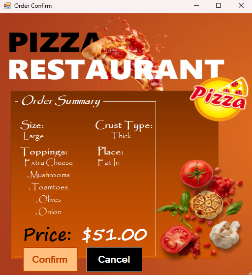
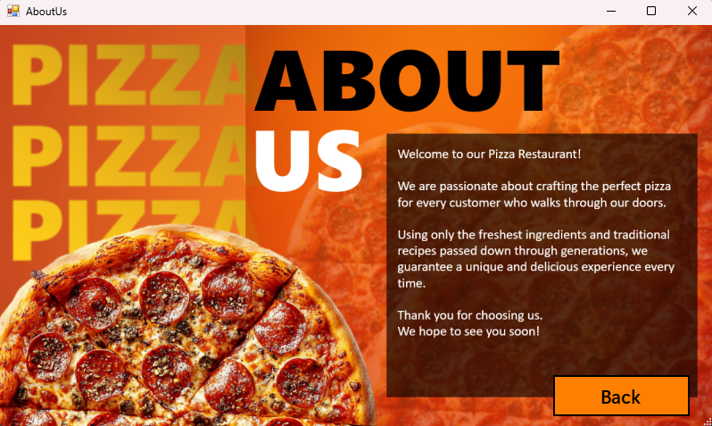

# 🍕 Pizza Order Project

A Windows Forms desktop application built with **C#** that allows users to customize and place pizza orders through a clean and interactive UI.

---

## 📋 Features

- **Main Screen** – Welcome page with navigation to Order and About Us
- **Order Details** – Fully customizable pizza order form including:
  - Crust type (Thin / Thick)
  - Size (Small / Medium / Large)
  - Toppings (Extra Cheese, Mushrooms, Tomatoes, Olives, Onion, Green Pepper)
  - Place (Eat In / Take Away)
  - Live price calculation
  - Order summary panel
- **Order Confirmation** – Displays a summary of the placed order
- **About Us** – Information page about the restaurant
- **Reset** – Clears all selections and starts a fresh order

---

## 🖥️ Screenshots

> ### Main Screen


### Order Details


### Order Confirmation


### About Us

---

## 🛠️ Built With

- C# (.NET Framework)
- Windows Forms (WinForms)
- Visual Studio

---

## 🚀 How to Run

1. Clone the repository:
   ```bash
   git clone https://github.com/your-username/pizza-order-project.git
   ```
2. Open the solution file `Pizza Order Project.sln` in **Visual Studio**
3. Press **F5** or click **Start** to run the project

---

## 📁 Project Structure

```
Pizza Order Project/
│
├── PizzaRestaurant.cs        # Main welcome screen
├── OrderDetails.cs           # Pizza customization screen
├── OrderConfirm.cs           # Order confirmation screen
├── AboutUs.cs                # About the restaurant screen
├── Resources/                # Images and assets
└── Program.cs                # Entry point
```

---

## 🎓 Purpose

This project was built as part of a **C# Level 1** course to practice:
- Windows Forms UI design
- Event-driven programming
- Form navigation and data passing between forms
- Resource management in Visual Studio

---

## 👨‍💻 Author

- **Mohamed Sorour**
- GitHub: [@MohamedOSorour](https://github.com/MohamedOSorour)

---